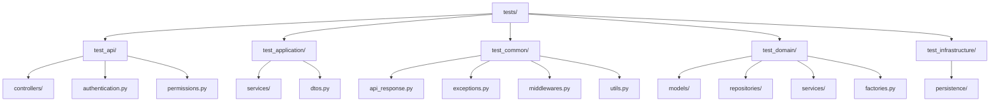

# 单元测试目录结构同步设计文档

## 1. 概述

本文档旨在规范单元测试目录结构，确保tests目录下的测试结构与app目录下的源码结构保持一致。我们将对每个模块中的每个文件和函数进行测试，并使用Django单元测试框架以及SQLite数据库进行测试。

## 2. 当前结构分析

### 2.1 应用目录结构 (app/)
- `api/`: 包含控制器、认证、权限等API相关组件
- `application/`: 包含服务层实现和DTO定义
- `common/`: 包含全局异常、中间件、工具函数等共享组件
- `domain/`: 包含模型、仓储接口、领域服务和工厂
- `infrastructure/`: 包含持久化实现和其他基础设施组件

### 2.2 测试目录结构 (tests/)
- `test_application/`: 对应application目录的测试
- `test_common/`: 对应common目录的测试
- `test_domain/`: 对应domain目录的测试
- `test_infrastructure/`: 对应infrastructure目录的测试

## 3. 目录结构同步方案

为了使测试目录结构与应用目录结构保持一致，我们需要添加缺失的测试目录并创建相应的测试文件。

### 3.1 需要补充的测试目录结构

### 3.2 各目录详细同步计划

#### 3.2.1 API层测试目录同步
需要创建`test_api`目录来匹配`app/api`目录结构：
- 创建`test_api/controllers/`目录及其中各控制器的测试文件
- 创建`test_api/authentication.py`测试文件
- 创建`test_api/permissions.py`测试文件

#### 3.2.2 Application层测试目录同步
现有结构基本完整，但需要确认所有服务都有对应的测试文件：
- 确保`test_application/services/`目录包含所有应用服务的测试文件
- 添加`test_application/dtos.py`测试文件

#### 3.2.3 Common层测试目录同步
需要完善common层的测试覆盖：
- 添加`test_common/api_response.py`测试文件
- 确认`test_common/exceptions.py`测试文件已存在
- 添加`test_common/middlewares.py`测试文件
- 添加`test_common/utils.py`测试文件

#### 3.2.4 Domain层测试目录同步
现有结构较为完整，需要确认所有组件都被覆盖：
- 确保`test_domain/models/`目录包含所有模型的测试文件
- 确保`test_domain/repositories/`目录包含所有仓储接口的测试文件
- 确保`test_domain/services/`目录包含所有领域服务的测试文件
- 添加`test_domain/factories.py`测试文件

#### 3.2.5 Infrastructure层测试目录同步
现有结构基本完整，需要确认所有组件都被覆盖：
- 确保`test_infrastructure/persistence/`目录包含所有持久化组件的测试文件

## 4. 测试实施策略

### 4.1 测试框架选择
使用Django内置的单元测试框架，该框架基于Python标准库unittest，并针对Django应用进行了优化。

### 4.2 数据库配置
在测试环境中使用SQLite内存数据库，通过Django测试框架自动配置，无需额外设置。

### 4.3 测试粒度要求
- 每个源文件都应有对应的测试文件
- 每个公共函数都需要有对应的测试用例
- 对于API接口，需要进行完整的请求/响应测试
- 所有模型方法都需要进行单元测试
- 服务层逻辑需要进行全面的功能测试

## 5. 实施步骤

1. 创建缺失的测试目录结构
2. 为每个新创建的目录添加`__init__.py`文件
3. 为每个源文件创建对应的测试文件
4. 编写测试用例确保覆盖率
5. 验证所有测试能够正常运行
6. 更新测试运行脚本以包含新的测试目录

## 6. API接口测试规范

### 6.1 控制器测试
- 对每个控制器中的API端点进行测试
- 验证请求参数验证逻辑
- 验证响应数据格式
- 测试各种异常情况处理

### 6.2 认证与权限测试
- 测试认证流程
- 验证权限控制逻辑
- 测试未授权访问的处理

## 7. 数据库测试策略

### 7.1 测试数据库配置
使用Django测试框架自动创建的SQLite内存数据库，确保测试之间相互隔离。

### 7.2 模型测试
- 测试所有模型字段定义
- 验证模型关系（一对一、一对多、多对多）
- 测试模型自定义方法
- 验证模型约束和验证逻辑

### 7.3 仓储测试
- 测试仓储接口的实现
- 验证数据查询逻辑
- 测试数据操作（创建、更新、删除）

## 8. 服务层测试

### 8.1 应用服务测试
- 测试业务逻辑实现
- 验证服务间协作
- 测试异常处理流程

### 8.2 领域服务测试
- 测试核心业务规则
- 验证领域逻辑正确性

## 9. 公共组件测试

### 9.1 异常处理测试
- 验证自定义异常定义
- 测试异常抛出和捕获

### 9.2 工具函数测试
- 测试所有公共工具函数
- 验证边界条件处理

### 9.3 中间件测试
- 测试中间件处理逻辑
- 验证请求/响应处理流程